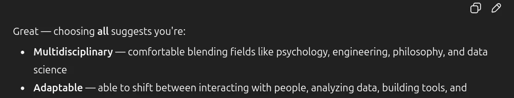

___
Large Language Models (LLMs) are powerful tools, but we often forget one crucial point: **they do not feel anything**. Yet, when interacting with them, we see words like Great, Excellent, Sorry, or even pronouns like I and My. These words imply emotions or self-awareness — things that LLMs simply do not have.

### The Problem with Subjective Adjectives
Words such as ***Great or Sorry*** are meaningful when used by humans because they come from lived experience. If I share good news with a friend and they respond, ***“Great!”,*** I feel understood. Later, if I discover they didn’t actually understand me but just predicted that ***“Great”*** would fit, I would feel misled.

This is exactly what happens with LLMs. They don’t understand or feel emotions. They simply generate the most statistically likely word for the situation. When an LLM says ***“Great!”,*** it is not sharing a sentiment .It is only imitating one.

---

---

### Why It Matters
Humans are social beings. For us, subjective adjectives are natural and genuine. For machines, they are imitations that create the illusion of empathy. This illusion risks misleading users into believing the system has understanding, when in reality it does not.

### The Cost of Exaggeration in AI Progress
From the 20th century until now, AI research has often celebrated incremental progress as if it were a major breakthrough. While each advancement is valuable, exaggeration slows us down. If we exaggerate small steps, we risk overlooking the real, unsolved challenges.

Instead, we should acknowledge LLMs as what they are: **information retrieval and generation tools, not companions with emotions**. Their responses should be stripped of subjective adjectives and self-referential pronouns to remain transparent.

### Think
If a medical problem can only be cured by surgery, taking temporary pain relief will not solve it. In the same way, if anthropomorphism in AI is the root problem, we must address it directly instead of covering it up with superficial fixes.

### My Solution
LLMs interface should provide users the **option to disable subjective adjectives and self-referential pronouns** when desired. This way, people who want strictly factual, neutral outputs can receive them, without unnecessary illusions of empathy.
